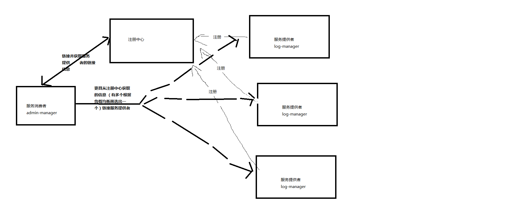

##### 简图

##### 总结

有3个项目，使用的服务中心是eureka
- admin-manager 服务消费者
- log-manager 服务提供者
    - core 核心代码 服务处理代码 不对外开放
    - facade 
    服务提供者个服务消费者共用的模块
    比如 数据传输的model 等
- service-registory-center 服务注册中心
##### service-registory-center 
服务注册中心 需要添加jar包
```xml
<dependency>
    <groupId>org.springframework.cloud</groupId>
    <artifactId>spring-cloud-starter-eureka-server</artifactId>
</dependency>
```
在配置中配置相关配置具体看application.yml
在启动类加@EnableEurekaServer


##### admin-manager
服务消费者 需要需要添加jar包
 ```xml
 <dependency>
     <groupId>org.springframework.cloud</groupId>
     <artifactId>spring-cloud-starter-eureka</artifactId>
 </dependency>
 ```
 在配置中配置相关配置具体看application.yml
 在启动类加@EnableDiscoveryClient
 调用远程服务添加jar包
 ```xml
 <dependency>
            <groupId>org.springframework.cloud</groupId>
            <artifactId> spring-cloud-starter-feign</artifactId>
        </dependency>
```
 在启动类加@EnableFeignClients
 写一个接口在接口上添加@FeignClient 设置value属性为调用服务的名称
 具体请看
 ```java
@FeignClient(value = "log-manager")
//value属性是服务名称
public interface LogFacade {

    @PostMapping("/log/add")
    String add(@RequestBody Log log);
}
```
##### log-manager
服务提供者 需要需要添加jar包
 ```xml
 <dependency>
     <groupId>org.springframework.cloud</groupId>
     <artifactId>spring-cloud-starter-eureka</artifactId>
 </dependency>
 ```
 在配置中配置相关配置具体看application.yml
 在启动类加@EnableEurekaClient